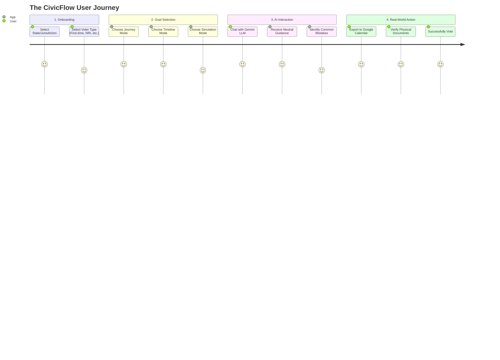
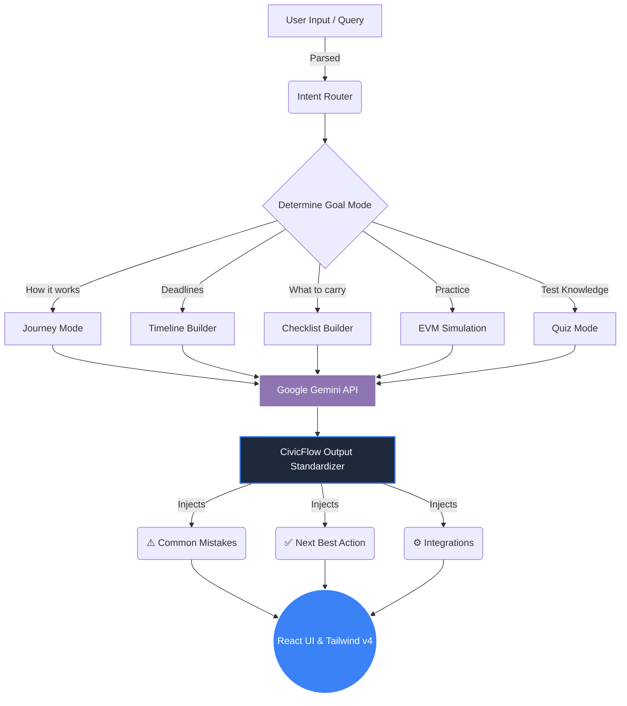

# 🏛️ CivicFlow Atlas

> **An interactive election journey guide that turns confusion into clarity—step‑by‑step, timeline‑aware, and strictly neutral.**

[](https://reactjs.org/)
[](https://vitejs.dev/)
[](https://tailwindcss.com/)
[](https://ai.google.dev/)
[](https://cloud.google.com/run)

CivicFlow Atlas is a next-generation civic-education assistant designed specifically for navigating complex electoral systems (currently optimized for the **Indian Election System**). It empowers first-time voters, busy professionals, and seniors by providing personalized, interactive, and highly actionable guidance without any political bias.

---

## 🛑 The Problem

Voter turnout is often affected not by apathy, but by **logistical friction and misinformation**. 
1. **Complexity:** First-time voters are overwhelmed by forms (Form 6, Form 8) and deadlines.
2. **Bias:** Most online sources are politically motivated or flooded with propaganda.
3. **Anxiety:** Fear of doing something wrong at the polling booth (EVM machines, VVPAT verification).

## 💡 Our Solution

CivicFlow Atlas removes the friction of voting through **AI-powered interactive guidance**. It does not tell you *who* to vote for; it tells you exactly *how, when, and where* to vote based on your specific jurisdiction.

---

## 🗺️ User Journey & App Flow

Here is how a user experiences CivicFlow Atlas:



---

## 🏗️ System Architecture

CivicFlow Atlas is powered by an advanced **State Machine & Intent Router** that processes user inputs through a strict "Neutrality & Actionability" framework before querying the LLM.



---

## ✨ Core Features

*   **🚫 Strict Neutrality Engine:** A hardcoded guardrail system that refuses political persuasion and instead provides a neutral "Evaluation Framework" to help users make their own decisions.
*   **📍 Jurisdiction-Aware:** Adapts rules and document checklists based on the user's specific State or Union Territory.
*   **🗓️ Exportable Timelines:** Generates T-30, T-7, and Day-0 polling plans with UI integrations.
*   **🎮 Interactive Simulations:** Walk through the physical polling booth experience (EVM/VVPAT) in a text-based, risk-free environment.
*   **🧠 Real-Time Adaptive Quizzes:** Evaluates user knowledge dynamically using conversation memory and LLM evaluation.

---

## 💻 Local Setup & Cloning Instructions

Want to run CivicFlow Atlas on your own machine? Follow these exact steps:

### 1. Clone the Repository
Open your terminal or command prompt and run:
```bash
git clone https://github.com/YOUR-GITHUB-USERNAME/civicflow-atlas.git
cd civicflow-atlas
```
*(Note: Replace `YOUR-GITHUB-USERNAME` with your actual GitHub username).*

### 2. Install Dependencies
Make sure you have [Node.js](https://nodejs.org/) installed, then run:
```bash
npm install
```

### 3. Set up your API Key
Create a file named `.env` in the root of the project folder. Add your Google Gemini API key:
```env
VITE_GEMINI_API_KEY=AIzaSyYourSecretKeyHere...
```
*(You can get a free key from [Google AI Studio](https://aistudio.google.com/)).*

### 4. Start the Application
```bash
npm run dev
```
Open [http://localhost:5173](http://localhost:5173) in your browser. The app will automatically connect to the AI!

---

## ☁️ Deployment (Google Cloud Run)

This project is fully competition-ready. It includes a custom `Dockerfile` designed for high-performance static hosting via Nginx.

### How to Deploy from GitHub to Google Cloud Run:
1. Push your code to your GitHub repository.
2. Go to the [Google Cloud Run Console](https://console.cloud.google.com/run).
3. Click **"Create Service"** and select **"Continuously deploy from a repository"**.
4. Authorize GitHub and select your `civicflow-atlas` repository.
5. In the Build Configuration, select **Dockerfile** (Google Cloud will automatically detect the Dockerfile provided in this repo).
6. Expand **"Environment Variables"** and add:
   * **Name:** `VITE_GEMINI_API_KEY`
   * **Value:** *(Your actual API key)*
7. Check **"Allow unauthenticated invocations"**.
8. Click **Deploy**. In ~2 minutes, your app will be live and ready for the judges!

---
*Built to turn confusion into clarity. Vote smart. Vote safe.*
